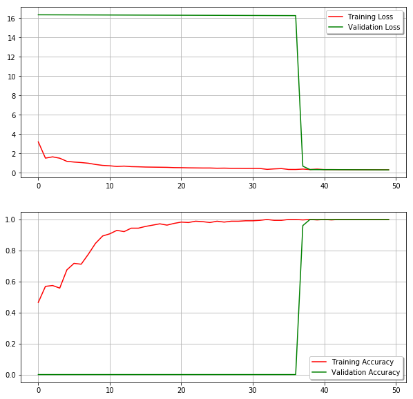

# Description
1. Drowsiness detection based on EAR
2. EAR based on dlib's facial landmark

# Feature
1. *.py file for detect drowsiness step by step
2. run video_drowniess_detect.py, when detect drowsiness, serial sends alarm and arduino starts vibrated.

# heart beat for detection
1. bluetooth.py for collect heart beat data 10ms, 500 per sample.
2. drowsiness detection using heart beat is limited by data scales and simple device
3. Conv1D network was utilized to end-to-end classify drowsiness state and awake state
4. validation accuracy reaches 100%, and shows convergence after 50 epochs using ResNet 1D

# loss and accuracy curve

# Reference
1. [Kräuchi, K., Cajochen, C., & Wirz-Justice, A. (1997). A relationship between heat loss and sleepiness: effects of postural change and melatonin administration. Journal of Applied Physiology, 83(1), 134–139](https://sci-hub.se/10.1152/jappl.1997.83.1.134)
2. [Jacobé de Naurois, C., Bourdin, C., Stratulat, A., Diaz, E., & Vercher, J.-L. (2017). Detection and prediction of driver drowsiness using artificial neural network models. Accident Analysis & Prevention.](https://sci-hub.se/10.1016/j.aap.2017.11.038)
3. [Solaz, J., Laparra-Hernández, J., Bande, D., Rodríguez, N., Veleff, S., Gerpe, J., & Medina, E. (2016). Drowsiness Detection Based on the Analysis of Breathing Rate Obtained from Real-time Image Recognition. Transportation Research Procedia, 14, 3867–3876.](https://sci-hub.se/https://doi.org/10.1016/j.trpro.2016.05.472)
4. [Vicente, J., Laguna, P., Bartra, A., & Bailón, R. (2016). Drowsiness detection using heart rate variability. Medical & Biological Engineering & Computing, 54(6), 927–937. ](https://sci-hub.se/https://doi.org/10.1007/s11517-015-1448-7)
5. [Jo SH, Kim JM, Kim DK. Heart Rate Change While Drowsy Driving. J Korean Med Sci. 2019;34(8):e56. Published 2019 Feb 12. doi:10.3346/jkms.2019.34.e56](https://www.ncbi.nlm.nih.gov/pmc/articles/PMC6393761/)
6. [drowsiness detection using openCV](https://www.pyimagesearch.com/2017/05/08/drowsiness-detection-opencv/)
7. [Conv1D network for MIT heart beat data](https://www.kaggle.com/coni57/model-from-arxiv-1805-00794)
8. [ResNet1D](https://github.com/Jun-depo/Resnet50_Conv1D)